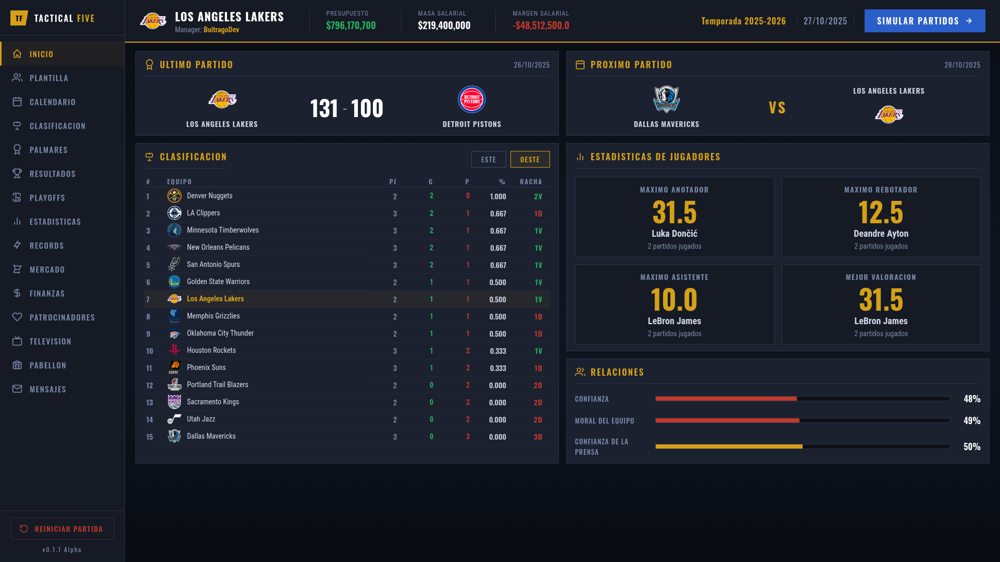
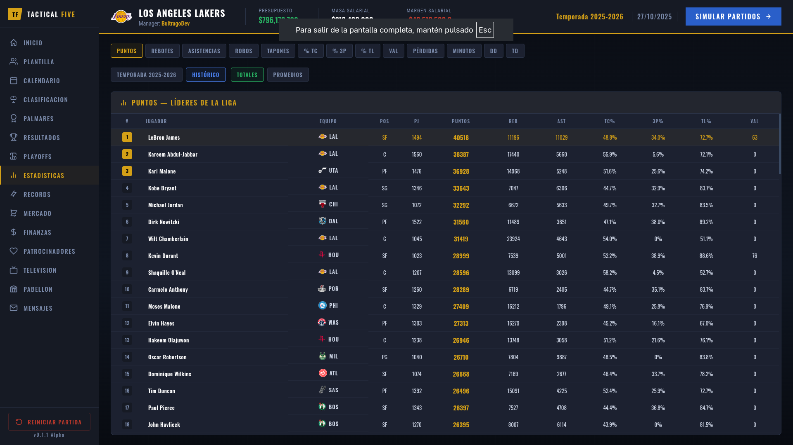
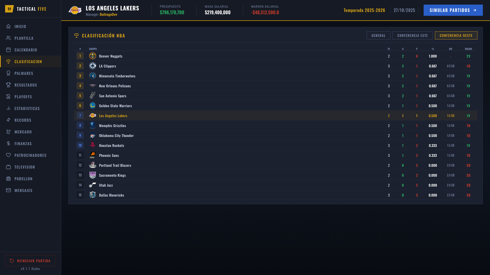
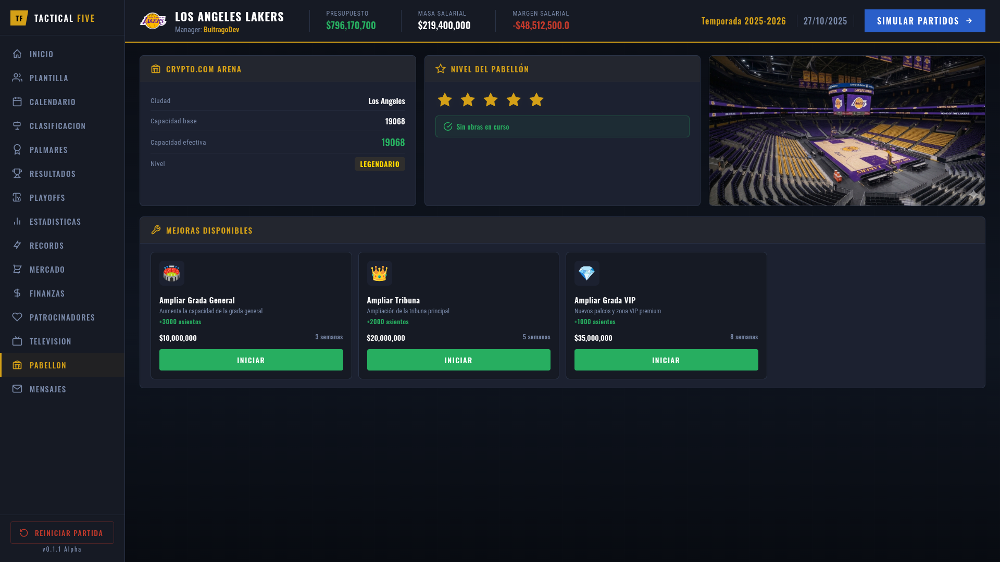
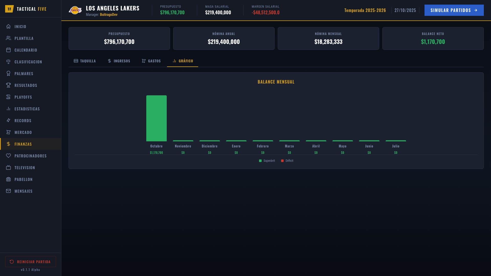

<div align="center">
 
# 🏀 TACTICAL FIVE
 
### Gestor de equipos NBA basado en la web

[](https://python.org)
[](https://djangoproject.com)
[](LICENSE)
[](https://sqlite.org)
<br />
[](https://opencode.ai)
[](https://opencode.ai/docs/zen/)

*Toma el control de tu franquicia, ficha estrellas, gestiona las finanzas y lleva a tu equipo al campeonato.*

</div>

---

## ¿Qué es Tactical Five?

**Tactical Five** es un simulador de gestión deportiva donde lideras una franquicia de la NBA. Toma decisiones tácticas partido a partido, firma jugadores, negocia contratos de televisión, gestiona el salary cap y compite por el anillo.

---

## ✨ Características

### 🏟️ Gestión de Equipo
| Función | Descripción |
|---|---|
| 👥 Plantilla completa | 15 jugadores con overall, potencial, salario y años de contrato |
| 🤕 Sistema de lesiones | Diferentes tipos con tiempos de recuperación variables |

### 📅 Sistema de Temporadas

```
Temporada Regular (82 partidos)  →  Play-In Tournament  →  Playoffs (Best of 7)  →  Draft
```

### 💰 Gestión Financiera
- **Salary Cap & Luxury Tax** — sistema fiel a la NBA real
- **Patrocinadores** — ingresos por partido según acuerdos firmados
- **Contratos de TV** — ingresos mensuales recurrentes
- **Entradas y abonos** — configura precios y maximiza la asistencia
- **Remodelaciones** — invierte en el pabellón para aumentar capacidad e ingresos

### 🎮 Jugabilidad
- ⏩ **Avance día a día** — simula partidos individualmente
- 📊 **Estadísticas detalladas** — registros por jugador y por partido
- 🏆 **Récords históricos** — estadísticas acumuladas de toda la liga
- 📬 **Sistema de mensajería** — notificaciones de lesiones, partidos y renovaciones

---

## 🚀 Instalación

### Requisitos previos
- Python 3.10+
- pip

### Pasos

```bash
# 1. Clona el repositorio
git clone https://github.com/tu-usuario/tactical-five.git
cd tactical-five

# 2. Crea y activa el entorno virtual
python -m venv venv             # Linux
py -m venv venv                 # Windows

source venv/bin/activate        # Linux / macOS
venv\Scripts\activate           # Windows

# 3. Instala las dependencias
pip install -r requirements.txt

# 4. Inicializa la base de datos
python manage.py migrate
python manage.py poblar_db

# 5. ¡Arranca el servidor!
python manage.py runserver
```

Abre tu navegador en **[http://127.0.0.1:8000](http://127.0.0.1:8000)** 🎉

---

## 📁 Estructura del Proyecto

```
tactical-five/
│
├── core/                        # Aplicación principal
│   ├── management/commands/
│   │   └── poblar_db.py         # Población inicial de la BD
│   ├── migrations/              # Migraciones de Django
│   ├── models.py                # Modelos de datos
│   ├── views.py                 # Vistas y lógica de negocio
│   ├── schedule_generator.py    # Generador de calendarios
│   ├── game_simulator.py        # Simulación de partidos
│   ├── draft_generator.py       # Generador de draft
│   └── templates/               # Plantillas HTML
│
├── static/                      # Archivos estáticos
│   ├── css/                     # Estilos
│   ├── logos/                   # Logos de equipos
│   ├── jerseys/                 # Uniformes
│   └── arenas/                  # Imágenes de pabellones
│
├── templates/                   # Plantillas base
├── config/                      # Configuración de Django
├── manage.py
└── requirements.txt
```

---

## 🛠️ Tecnologías

<div align="center">

| Capa | Tecnología |
|---|---|
| **Backend** | Django 6.0 |
| **Frontend** | HTML5, CSS3, JavaScript |
| **Base de datos** | SQLite (desarrollo) |
| **Tipografía** | Google Fonts — Oswald, Roboto Condensed |
| **Imágenes** | Pillow 11.0+ |

</div>

---

## 📸 Capturas de Pantalla

<br/>
<div align="center">
  <table>
    <tr>
      <td></td>
      <td></td>
    </tr>
    <tr>
      <td></td>
      <td></td>
    </tr>
    <tr>
      <td colspan="2" align="center"></td>
    </tr>
  </table>
</div>
<br/>

## 🤝 Contribuir

¡Las contribuciones son bienvenidas! Si quieres mejorar Tactical Five:

1. Haz un **fork** del repositorio
2. Crea una rama para tu feature: `git checkout -b feature/nueva-funcionalidad`
3. Haz commit de tus cambios: `git commit -m 'feat: añade nueva funcionalidad'`
4. Sube la rama: `git push origin feature/nueva-funcionalidad`
5. Abre un **Pull Request**

Para bugs o sugerencias, por favor [abre un issue](../../issues).

---

## 📄 Licencia

Este proyecto está disponible bajo la licencia **MIT**. Consulta el archivo [LICENSE](LICENSE) para más detalles.

---

<div align="center">

Hecho con ❤️ y mucha pasión por el baloncesto

⭐ Si te gusta el proyecto, ¡dale una estrella!

</div>
